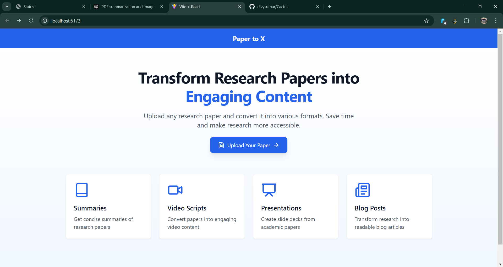
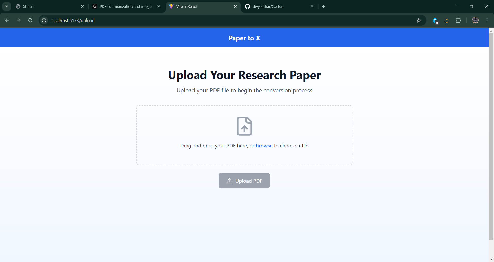
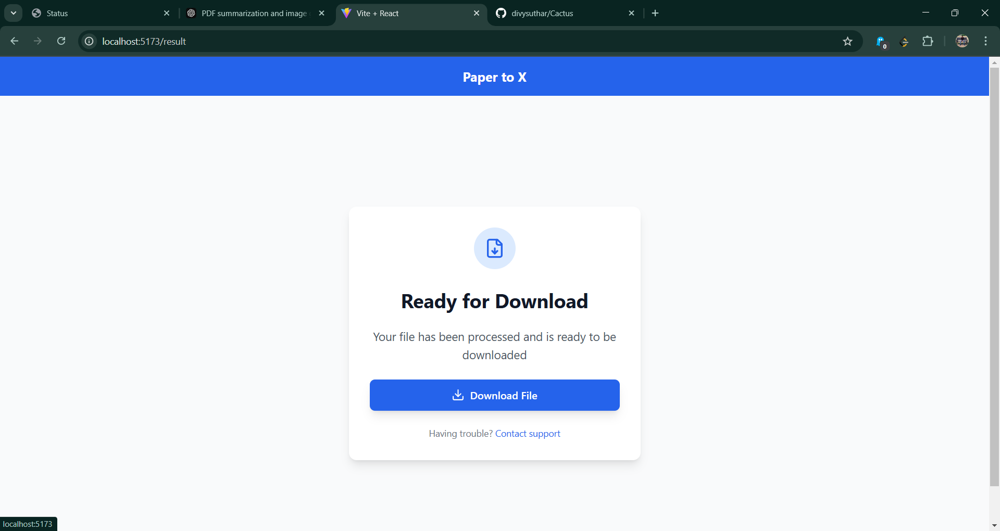

# MINeD - Research Paper Processing API

MINeD (Minimalistic Document Summarizer and Extraction for Disaster Management) processes research papers and extracts meaningful summaries and prompts to assist in disaster management decision-making.

## Project Screenshots

### Home Output


### Upload Page


### Download


## Video

## Video Demonstration

[Demo Video 1](./video/final_output%20(9).mp4)

[Demo Video 2](./video/WhatsApp%20Video%202025-02-01%20at%2011.23.17_14af0f65.mp4)


## Installation & Setup

1. Clone the repository:
   ```bash
   git clone https://github.com/yourusername/mined.git
   cd mined/backend
